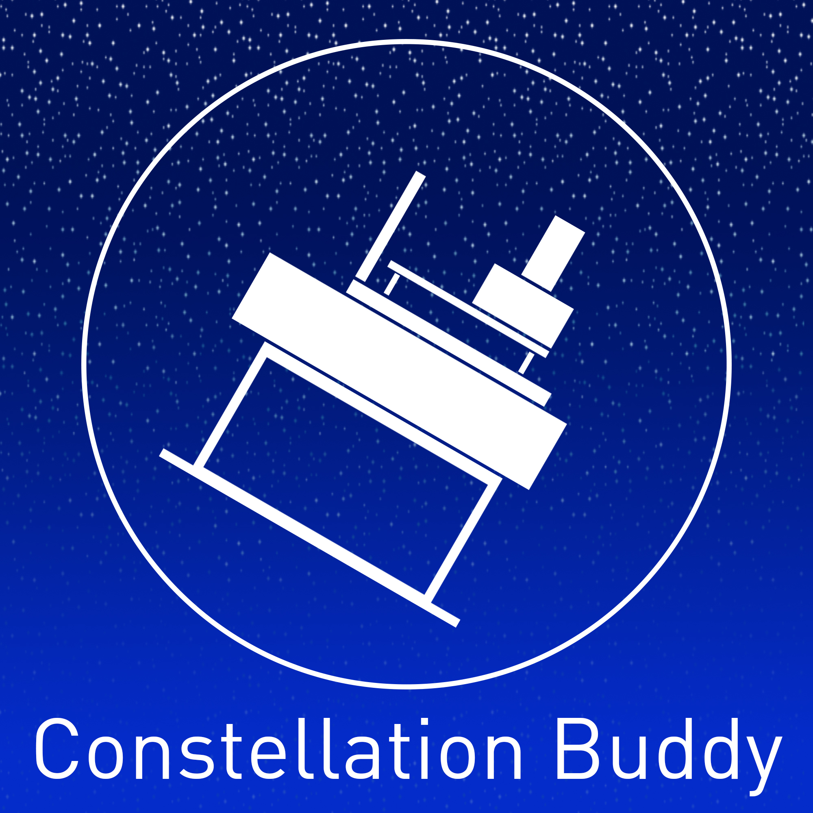

## Inspiration
Stargazing is appealing to a very wide audience. Although there are a lot of constellation maps to help stargazers find interesting constellations and other points of interest, it can still be a very tedious process. Clouds or other stars could also get in the way making it hard to determine exactly where the constellation is, if it is even visible. But what if a robot could take care of this troubling process?

## What is Constellation Buddy?
Constellation Buddy helps with finding constellations, tracking which ones are visible, and keeping the telescope pointed at them. Constellation Buddy offers an easy to navigate interface with a labelled map of visible constellations. By just clicking on a constellation, the telescope will rotate into place to focus on that constellation. As the night goes on, the telescope will readjust itself to keep a centred view of the constellation.

## How is it built?
Constellation Buddy is driven by a NI MyRIO board which is programmed in LabView. The MyRIO acts as a WebSocket server, which listens to positioning messages generated by a user's clicks on our beautiful graphical interface. A Python script acts as the middleman between the user application and the server, which will allow for rapid modular implementation of new features such as better constellation detection.

## Challenges
Getting the Java GUI to communicate with LabView took a long time to get set up. Java was not able to communicate directly to Labview, so a Python script had to be set up as a middle ground to connect Java and LabView.

## Next steps
To better improve the experience, OpenCV could be used to analyze a camera feed live from the robot. Since the GUI is built with Java, more advanced OpenCV functions are available. This would allow for a live visualization of the night sky, which could have constellations identified and pointed out by OpenCV image identification.
